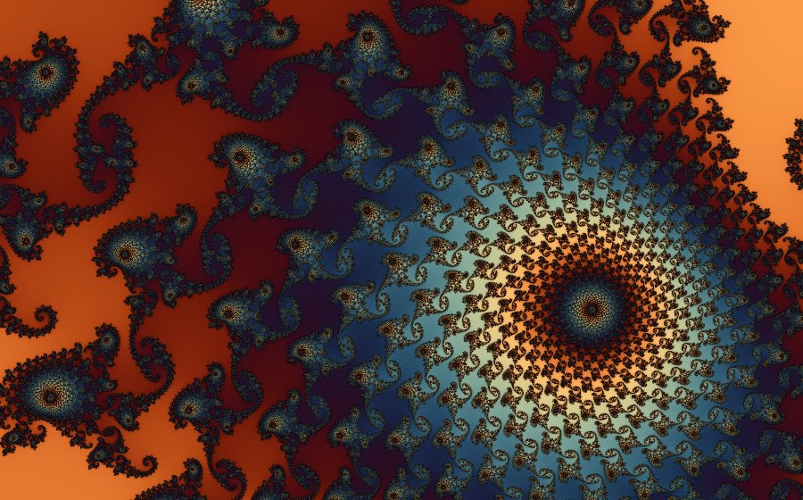

# Fraktalz

**A real-time Mandelbrot flythrough — and a benchmark that makes your silicon confess.**

Most benchmarks are synthetic. This one is a fractal: the same `z² + c`
escape-time workload — a 1024×1024 tile on the Seahorse Valley boundary,
5,000 max iterations — executed on every compute backend your machine has,
with the iteration counts **read back and cross-checked between backends**
so the numbers are measured work, not estimates.

## The numbers (i9-13900K-class + RTX 4070)

| backend | precision | threads | ms/frame | Giter/s | vs 1 core |
|---|---|---|---|---|---|
| CPU, single core | fp64 | 1 | 271.8 | 0.54 | 1.0× |
| CPU, numba/AVX | fp64 | 32 | 21.3 | 6.90 | 12.8× |
| RTX 4070 | fp32 | – | 0.4 | **352.9** | 653.8× |
| RTX 4070 | fp64 | – | 228.5 | 0.64 | 1.2× |

Three things fall out of that table:

1. **A consumer GPU does a third of a *trillion* fractal iterations per
   second** at fp32 — the whole tile in 0.4 ms.
2. **The fp64 cliff is worse than the spec sheet.** NVIDIA quotes 1:64
   fp64:fp32 throughput on consumer Ada. Measured on a real divergent
   fragment-shader workload: **~1:550**, because two fp64 units per SM
   plus doubled register pressure gut occupancy on top of the throughput
   cut.
3. **The CPU beats the GPU at double precision — by 10×.** Thirty-two
   threads of LLVM-vectorised AVX out-iterate the 4070 the moment you ask
   for doubles. This is exactly why the renderer does perturbation theory
   instead of brute-force fp64.

Honesty footnote: the GPU/CPU fp64 cross-check disagrees on 0.37% of
pixels — boundary points where floating-point rounding order flips the
escape count by ±1. Expected, and reported rather than hidden.

Run it yourself:

    python Fraktalz.py --bench

There is a browser twin in [`web/`](web/) — same workload in JS
(single-thread and Web Workers) and WebGL2 (fp32, plus *emulated* fp64
via Dekker double-float arithmetic, because WebGL has no doubles at all
and the precision story deserved a third act).

## In the browser

Same workload, Chrome on the same machine ([`web/`](web/), one static file,
no build step):

| backend | precision | threads | ms/frame | Giter/s |
|---|---|---|---|---|
| JavaScript | fp64 | 1 | 281.6 | 0.52 |
| Web Workers | fp64 | 32 | 65.6 | 2.24 |
| RTX 4070 via ANGLE/D3D11 | fp32 | \u2013 | 2.79 | 52.64 |
| RTX 4070 via ANGLE/D3D11 | df64 emulated | \u2013 | 3.03 | 48.47\u2020 |

Three findings:

1. **V8 gets within 4% of native.** Single-threaded JavaScript hits 0.52
   Giter/s against 0.54 for LLVM-compiled native code on the identical
   loop. The "JS is slow" era is long over for arithmetic like this.
2. **The ANGLE tax is ~7\u00d7.** The same GPU that does 353 Giter/s under
   native OpenGL manages 52.6 through the WebGL\u2192D3D11 translation layer.
3. **\u2020 The cross-check caught the shader compiler cheating.** The Dekker
   double-float emulation ran suspiciously close to fp32 speed \u2014 because
   the D3D11 compiler's fast-math reassociated the error-compensation
   terms away, silently destroying the emulated precision. Detected by
   comparing iteration counts against natively-fp64 JavaScript: 26% of
   pixels mismatched, vs 0.37% expected from rounding-order flips. A
   benchmark that validates its own answers finds things a stopwatch
   never will.

The GPU path requires a Chromium browser; Firefox rasterises
attribute-less triangles into the void and returns zeros without an
error. CPU rows run everywhere.
\n## The renderer

The benchmark is a by-product. The actual program is a real-time deep-zoom
flythrough:

- **Perturbation + Zhuoran rebasing** — one arbitrary-precision reference
  orbit (gmpy2/MPFR), every pixel iterated as an fp64 *delta* against it,
  rebasing when the delta overtakes the reference. Verified against
  arbitrary-precision ground truth to radius **1e-33** (`--selftest`).
- **Adaptive resolution** — while the camera moves, render at whatever
  fraction of native res fits the frame-time budget and upscale; motion
  hides the softness. When you stop, sub-pixel-jittered samples accumulate
  into a float buffer — batched to fill the whole frame budget — and the
  image converges to supersampled quality in front of you.
- **Derivative-based distance estimation** carried pre-scaled by pixel
  size, so a dz/dc of ~1e300 at depth never overflows.

## Fly

    python Fraktalz.py                    # fly
    python Fraktalz.py --list             # curated deep locations
    python Fraktalz.py --location 3       # drop into Scepter Valley
    python Fraktalz.py --still out.png --location 2 --width 3840 --height 2160
    python Fraktalz.py --selftest         # verify the maths, no window

Windows: double-click `mandelfly.bat` — first run builds a venv and
installs dependencies.

## Requirements

Python 3.10–3.12 recommended (numba). `pip install -r requirements.txt`.
GPU path needs OpenGL 4.3. Without numba the CPU paths still run,
single-threaded. Without gmpy2, mpmath is used automatically (~20× slower
reference orbits).
